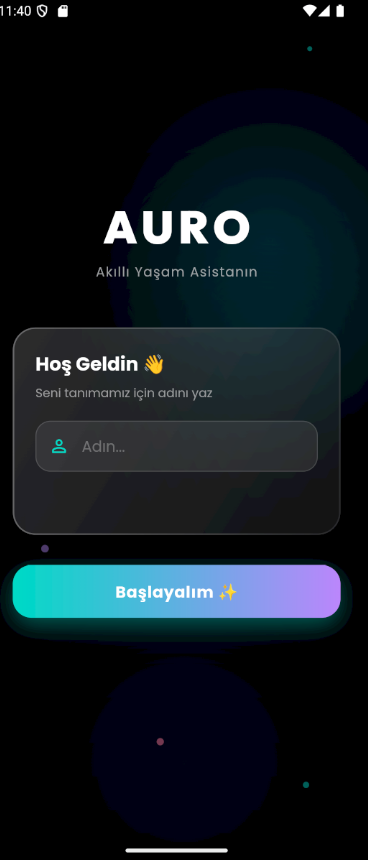
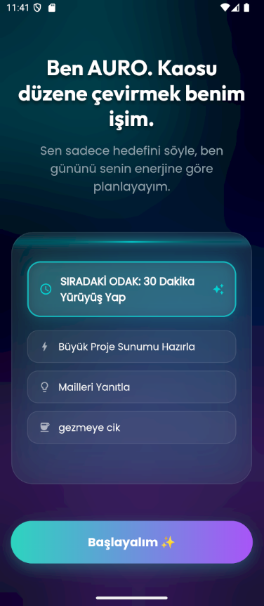
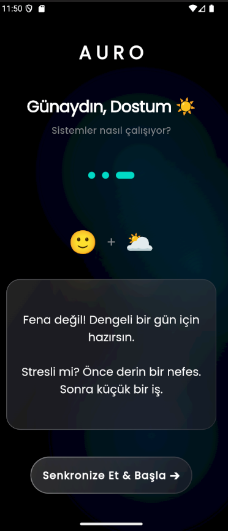
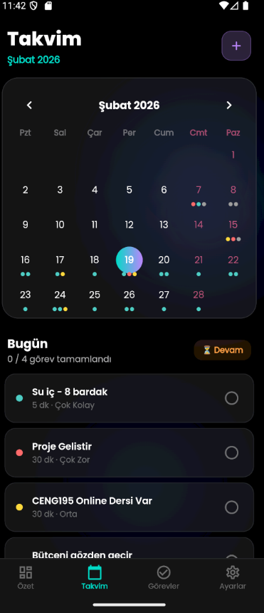
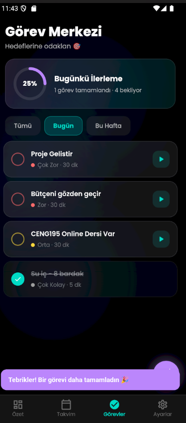

  <h1>🌌 Auro: Akıllı Yaşam Asistanı</h1>
  

    <b>Sıradan listeleri çöpe atın. Auro, gününüzü zamana göre değil enerjinize göre orkestre eden, yapay zeka destekli  asistanınızdır.</b>
  

  

    
    
    
    
  

---

## 💡 Neden Auro?
Auro, zihinsel sağlığınızı korurken üretkenliğinizi artırmayı hedefleyen, yapay zeka destekli yeni nesil bir görev ve odak yöneticisidir. Kaosu düzene çeviren "Aurora" temalı premium tasarımı ile uygulamanın içinde vakit geçirmek bir görev değil, terapi hissi verir.

Geleneksel "Yapılacaklar (To-Do)" uygulamaları devasa bir mimari hataya sahiptir: **İnsanların her saat aynı enerji seviyesinde makine gibi çalışacağını varsayarlar.** Alt alta yığılan bitmemiş görevler sadece anksiyete yaratır.

**Auro bu paradigmayı değiştirir.** Yapay zeka destekli altyapısıyla zihin durumunuzu analiz eder, görevlerinizi zorluk derecelerine göre parçalar ve size o anki enerjinize en uygun "Sıradaki Odağı (Next Focus)" sunar. Üstelik bunu büyüleyici bir 'Glassmorphism' arayüzü ile yapar.

---

## ✨ Görsel Deneyim & Temel Özellikler

Auro'nun mimarisi sadece işlevsellik üzerine değil, psikolojik rahatlama üzerine kurulmuştur.

<table align="center">
  <tr>
    <td align="center"><b>1. Giriş ekranı</b> </td>
    <td align="center"><b>2.AI analiz ekranı</b> AI senin için var</td>
  </tr>
  <tr>
    <td align="center"></td>
    <td align="center"></td>
  </tr>
  <tr>
    <td align="center"><b>3. Zihin Durumu & Empati</b> Kullanıcıyı anlayan yapay zeka akışı.</td>
    <td align="center"><b>4. Dashboard Ekranı</b> Kaostan düzene geçen akıllı "Dashboard".</td>
  </tr>
  <tr>
    <td align="center"></td>
   <td align="center"></td>
  </tr>
   <tr>
     <td align="center"><b>5. Dinamik Takvim & Gelişim</b> Zorluk derecelerini renk kodlarıyla analiz et.</td>
    <td align="center"><b>6.Görevler Ekranı</b> Görevlerini kontrol et.</td>
  </tr>
  <tr>
   <td align="center"></td>
    <td align="center"></td>
  </tr>
</table>

### 🚀 Öne Çıkan Modüller
* **🧠 Enerji ve Ruh Haline Göre Planlama:** Klasik alt alta yığılan listeler yerine, o anki ruh halinize ve enerji seviyenize (Çok Zor, Orta, Kolay) göre "Sıradaki Odağı" belirler.
* **🎨 Premium Glassmorphism Arayüzü:** Göz yormayan, derin uzay ve kuzey ışıklarından ilham alan karanlık tema (Dark Mode) ve buzlu cam detayları.
* **🌙 Aurora UI (Glassmorphism):** Mesh gradient arka planlar ve buzlu cam detayları. Karanlık mod ile göz yormayan, premium hissiyat.
* **📊 Dinamik Takvim ve İstatistikler:** Tüm ayınızı zorluk derecelerine göre renk kodlarıyla analiz edin ve gün sonu motivasyonunuzu artırın.

---

## 🛠️ Mimari ve Teknoloji Yığını

Auro, yüksek performans, kusursuz animasyonlar ve ölçeklenebilirlik prensipleriyle inşa edilmiştir.

* **Frontend:** `[Flutter]` - Cross-platform.
* **UI/UX Tasarım Dili:** Tailwind tabanlı özel Glassmorphism bileşenleri, Lottie animasyonları, Reanimated/Framer Motion.
* **Backend & Auth:** `[Firebase / Supabase]` - Gerçek zamanlı senkronizasyon ve güvenli kullanıcı yönetimi.
* **State Management:** `[Zustand / Redux Toolkit / Provider]` - Minimum re-render, maksimum akıcılık.
* **Yapay Zeka (AI):** Kullanıcı niyeti analizi ve gün planlama algoritması için özel entegrasyon.

---
